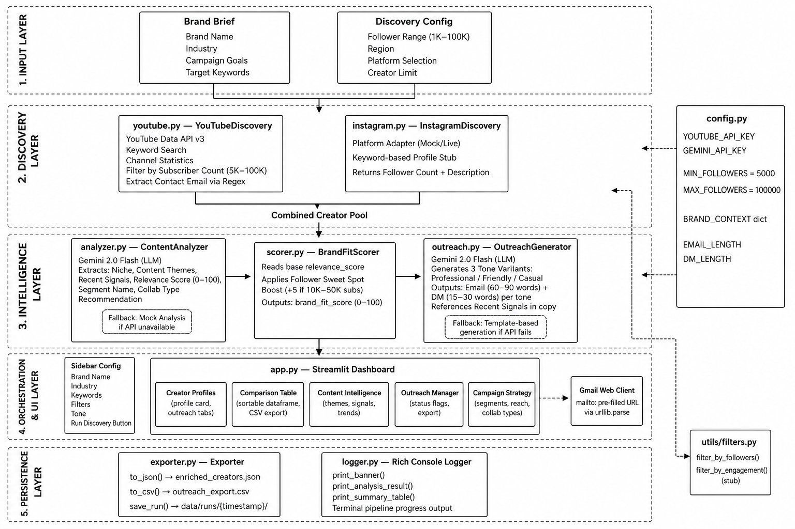

# OutreachOS: Creator Intelligence Platform

OutreachOS is an automated creator intelligence and outreach platform designed for modern brand marketing. It streamlines the entire influencer marketing workflow, from discovering niche micro-influencers to generating highly personalized outreach campaigns.

## Architecture Diagram

## Overview

Finding the right creators and writing personalized pitches is traditionally a manual, time-consuming process. OutreachOS solves this by combining real-time platform data with AI-driven content analysis to identify the best brand partnerships and automate the initial outreach process.

## Key Features

* Real-Time Creator Discovery: Connects to the YouTube Data API to find active creators based on specific keyword niches, automatically filtering for ideal micro-influencer follower ranges (1K - 100K).
* Content-Aware Analysis: Analyzes creator metadata to extract core content themes, recent video topics, and overall engagement quality.
* Dynamic Brand-Fit Scoring: Evaluates how well a creator aligns with your specific brand brief and industry, generating a 0-100 fit score accompanied by a logical explanation.
* Automated Data Enrichment: Calculates key metrics like average views, engagement rate (view-to-subscriber ratio), and estimated posting frequency dynamically without requiring manual spreadsheet data entry.
* Multi-Tone Personalization: Automatically drafts outreach emails and direct messages in three distinct tones (Professional, Friendly, Casual). The pitches are context-aware, referencing the brand's goals and the creator's specific recent content.
* Outreach Execution: Integrates directly with web email clients (Gmail), allowing you to open and send pre-filled, personalized pitches with a single click directly from the dashboard.

## System Architecture

The platform is built on a category-agnostic pipeline consisting of four main modules:

1. Discovery Layer: Interfaces with platform APIs (YouTube) and adapter patterns to discover relevant creators.
2. Intelligence Layer: Processes raw metadata using Large Language Models to understand the creator's audience and content quality.
3. Scoring Layer: Matches the creator's profile against the user-provided brand brief to determine partnership viability.
4. Orchestration Layer: An interactive Streamlit dashboard that coordinates the workflow and presents data through comparison tables, metrics, and creator profile cards.

### Pipeline Stages

| Stage | Module | Description |
|---|---|---|
| 1 | `youtube.py` | Queries YouTube API for active creators matching target keywords and micro-influencer constraints (1k-100k subs). |
| 2 | `instagram.py` | Platform-agnostic adapter module for discovering Instagram creators without requiring OAuth. |
| 3 | `analyzer.py` | Uses Gemini AI to analyze raw signals and extract precise content themes and engagement quality. |
| 4 | `scorer.py` | Calculates a 100-point Brand-Fit Score aligning creator niches to the user's specific Brand Brief. |
| 5 | `outreach.py` | Leverages Gemini 2.0 to draft 3 highly personalized, context-aware collaboration templates (Email & DM). |
| 6 | `app.py` | Orchestrates the entire pipeline through an interactive Streamlit UI with visual metrics and CSV exports. |

## Setup Instructions

1. Clone the repository to your local machine.
2. Install the required dependencies:
   pip install -r requirements.txt
3. Create a `.env` file in the root directory and add your API keys:
   YOUTUBE_API_KEY=your_youtube_api_key
   GEMINI_API_KEY=your_gemini_api_key
4. Run the application:
   python -m streamlit run app.py

### Environment Variables

| Variable | Description | Required |
|---|---|---|
| `YOUTUBE_API_KEY` | Google Cloud API key for real-time YouTube discovery | Yes |
| `GEMINI_API_KEY` | API key for Google Gemini (used for AI content analysis and outreach) | Yes |

## Usage

1. Open the application in your browser.
2. Enter your brand name, industry, and a brief description of your campaign goals in the setup sidebar.
3. Input target keywords relevant to your niche and adjust the creator limits.
4. Click "Run Discovery" to initiate the automated pipeline.
5. Review the discovered creators, their brand-fit scores, and engagement metrics on the dashboard.
6. Select your preferred outreach tone and click the email link to send the generated pitch.

## Production Outreach Automation (Workflow)

While the current MVP utilizes a "Human-in-the-Loop" architecture (generating pre-filled web client URLs to ensure brand safety against AI hallucinations), a full programmatic production deployment would execute outreach autonomously using the following workflows:

### 1. Email Automation Workflow
Instead of triggering local email clients, the pipeline would integrate with **SendGrid API** (or **Brevo**) for scalable dispatch. 
* **Execution:** Once the `outreach.py` LLM generates the JSON template, the orchestrator triggers a `POST /v3/mail/send` request to SendGrid. 
* **Tracking:** A custom webhook endpoint would be established to listen for SendGrid events (Delivered, Opened, Clicked), automatically updating the local `creators.db` SQLite database to track campaign conversion rates dynamically.

### 2. Instagram DM Automation Workflow
Because Meta strictly restricts unauthorized scraping and direct messaging via the Graph API, production-level DM outreach requires a specialized adapter:
* **Official Approach:** If the brand possesses an approved Facebook Business account, the system would authenticate via OAuth and utilize the **Meta Graph API** to dispatch DMs programmatically to discovered Instagram creators.
* **Alternative Approach:** For broader outreach without strict Business restrictions, the system would leverage an **Apify Workflow** (e.g., the `apify/instagram-scraper` actor coupled with an automation wrapper) to dispatch DMs mimicking human browser behavior to avoid anti-bot rate limits.

## Technical Stack

* Language: Python
* Frontend: Streamlit
* External APIs: YouTube Data API v3, Google Gemini API
